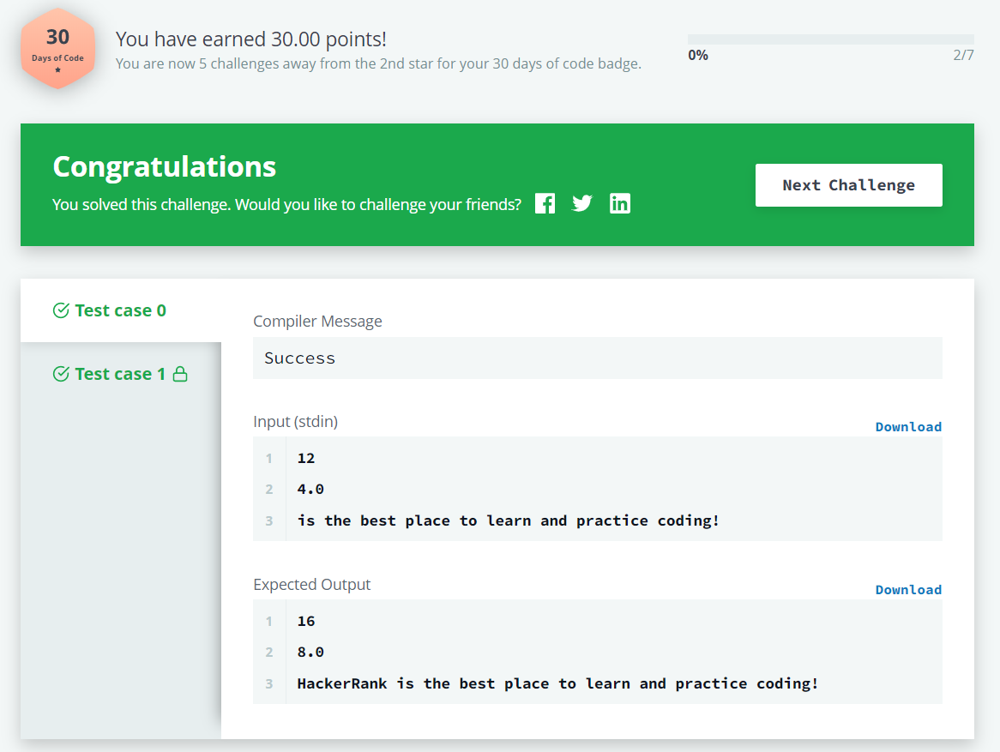

# Data Types

### Objective
Today, we're discussing data types. Check out the Tutorial tab for learning materials and an instructional video!

Complete the code in the editor below. The variables **i**, **d** and **s** are already declared and initialized for 
you. You must:

- Declare **3** variables: one of type int, one of type double, and one of type String.
- Read **3** lines of input from stdin (according to the sequence given in the Input Format section below) and 
    initialize your **3** variables.
- Use the **+** operator to perform the following operations:
    - Print the sum of ***i*** plus your int variable on a new line.
    - Print the sum of **d** plus your double variable to a scale of one decimal place on a new line.
    - Concatenate ***s*** with the string you read as input and print the result on a new line.
    
**Note:** If you are using a language that doesn't support using **+** for string concatenation (e.g.: C), you can just 
print one variable immediately following the other on the same line. The string provided in your editor must be printed 
first, immediately followed by the string you read as input.

### Input Format

The first line contains an integer that you must sum with **i**.
The second line contains a double that you must sum with **d**.
The third line contains a string that you must concatenate with **s**.

### Output Format

Print the sum of both integers on the first line, the sum of both doubles (scaled to **1** decimal place) on the second 
line, and then the two concatenated strings on the third line.

### Sample Input

    12
    4.0
    is the best place to learn and practice coding!
    

### Sample Output

    16
    8.0
    HackerRank is the best place to learn and practice coding!
    

### Explanation

When we sum the integers **4** and **12**, we get the integer **16**.

When we sum the floating-point numbers **4.0** and **4.0**, we get **8.0**.

When we concatenate HackerRank with is the best place to learn and practice coding!, we get HackerRank is the best 
place to learn and practice coding!.

**You will not pass this challenge if you attempt to assign the Sample Case values to your variables instead of 
following the instructions above and reading input from stdin.**

## Result 
**ALL TEST CASES PASSED**
