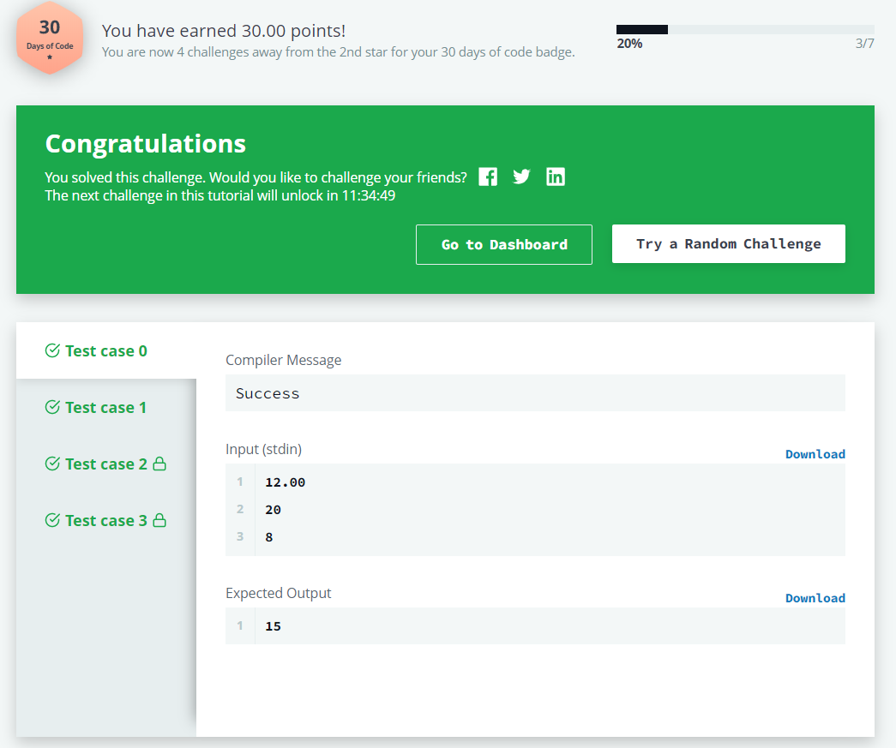

# Operators

### Objective

In this challenge, you'll work with arithmetic operators. Check out the Tutorial tab for learning materials and an 
instructional video!

### Task
Given the meal price (base cost of a meal), tip percent (the percentage of the meal price being added as tip), and tax 
percent (the percentage of the meal price being added as tax) for a meal, find and print the meal's total cost.

**Note:** Be sure to use precise values for your calculations, or you may end up with an incorrectly rounded result!

### Input Format

There are **3** lines of numeric input:
The first line has a double, ***mealCost*** (the cost of the meal before tax and tip).
The second line has an integer, ***tipPercent*** (the percentage of ***mealCost*** being added as tip).
The third line has an integer, ***taxPercent*** (the percentage of ***mealCost*** being added as tax).

### Output Format

Print the total meal cost, where ***totalCost*** is the rounded integer result of the entire bill 
(***mealCost*** with added tax and tip).

### Sample Input

    12.00
    20
    8
    
### Sample Output

    15

Explanation

*Given:*

***mealCost*** = *12*, ***tipPercent*** = *20*, ***taxPercent*** = *8*

Calculations:

***tip*** = 12 **X** (20/100) = **2.4**

***tax*** = 12 **X** (8/100) = **0.96**

***totalCost*** = ***mealCost*** + ***tip*** + ***tax*** = 12 + 2.4 + 0.96 = 15.36

***round(totalCost)*** = 15

We round ***totalCost*** to the nearest dollar (integer) and then print our result, **15**.

## Result 
**ALL TEST CASES PASSED**
